## Detailed Process Flow Diagram

```mermaid
graph TB
    %% Define the workflow stages
    subgraph stage1 ["🔄 Stage 1: Data Processing"]
        direction TB
        metadata[("📋 metadata")]
        dataDir[("📁 dataDir")] 
        runID[("🏷️ runID")]
        
        guppyplex["🧬 GUPPYPLEX<br/>───────────<br/>• Demultiplex reads<br/>• Quality filtering<br/>• Length filtering<br/>• Output: FASTQ"]
        
        metadata --> guppyplex
        dataDir --> guppyplex
        runID --> guppyplex
    end
    
    subgraph stage2 ["🦠 Stage 2: Consensus Generation"]
        direction TB
        artic["🦠 ARTIC minION<br/>──────────────<br/>• Primer trimming<br/>• Read alignment<br/>• Variant calling<br/>• Consensus generation<br/>• Output: FASTA, BAM, VCF"]
        
        guppyplex --> artic
    end
    
    subgraph stage3 ["🔧 Stage 3: Error Correction"]
        direction TB
        proovframe["🔧 PROOVFRAME<br/>─────────────<br/>• Detect frameshifts<br/>• Correct indel errors<br/>• Validate ORFs<br/>• Output: Corrected FASTA"]
        
        artic --> proovframe
    end
    
    subgraph stage4 ["🔬 Stage 4: Parallel Analysis"]
        direction LR
        alignment["📏 ALIGNMENT<br/>──────────<br/>• Multiple sequence<br/>  alignment (MAFFT)<br/>• Reference comparison<br/>• Output: Aligned FASTA"]
        
        nextclade["🌳 NEXTCLADE<br/>─────────<br/>• Clade assignment<br/>• Mutation calling<br/>• Quality metrics<br/>• Output: TSV, JSON"]
        
        pangolin["🐧 PANGOLIN<br/>────────<br/>• Lineage assignment<br/>• Probability scoring<br/>• Version tracking<br/>• Output: CSV report"]
        
        proovframe --> alignment
        proovframe --> nextclade
        proovframe --> pangolin
    end
    
    subgraph stage5 ["📊 Stage 5: Quality Control"]
        direction TB
        coverage["📊 COVERAGE<br/>─────────<br/>• Depth calculation<br/>• Breadth analysis<br/>• Quality assessment<br/>• Output: Coverage stats"]
        
        artic --> coverage
    end
    
    %% Output files
    subgraph outputs ["📁 Output Files Structure"]
        direction TB
        
        subgraph consensus_out ["Consensus & Variants"]
            cons_fasta["📄 *.consensus.fasta"]
            bam_out["📊 *.primertrimmed.bam"]
            vcf_out["🧬 *.vcf"]
        end
        
        subgraph analysis_out ["Analysis Results"]
            align_out["📏 *.aln"]
            nextclade_out["🌳 nextclade.tsv/json"]  
            pangolin_out["🐧 lineage_report.csv"]
        end
        
        subgraph qc_out ["Quality Control"]
            coverage_out["📈 *.coverage"]
        end
    end
    
    %% Connect to outputs
    artic -.-> cons_fasta
    artic -.-> bam_out  
    artic -.-> vcf_out
    alignment -.-> align_out
    nextclade -.-> nextclade_out
    pangolin -.-> pangolin_out
    coverage -.-> coverage_out
    
    %% Styling
    classDef stageStyle fill:#f8f9fa,stroke:#6c757d,stroke-width:2px
    classDef processStyle fill:#e3f2fd,stroke:#1976d2,stroke-width:2px
    classDef inputStyle fill:#e8f5e8,stroke:#4caf50,stroke-width:2px
    classDef outputStyle fill:#fce4ec,stroke:#e91e63,stroke-width:2px
    classDef parallelStyle fill:#fff3e0,stroke:#ff9800,stroke-width:2px
    
    class stage1,stage2,stage3,stage4,stage5 stageStyle
    class guppyplex,artic,proovframe,coverage processStyle
    class metadata,dataDir,runID inputStyle
    class alignment,nextclade,pangolin parallelStyle
    class outputs,consensus_out,analysis_out,qc_out outputStyle
```

## 📊 Resource Requirements & Runtime Estimates

| Process | CPU | Memory | Typical Runtime | Dependencies |
|---------|-----|--------|----------------|--------------|
| GUPPYPLEX | 1 cores | 2 GB | 2-5 min | Oxford Nanopore data |
| ARTIC | 2 cores | 4 GB | 10-20 min | ARTIC primer schemes |
| PROOVFRAME | 1 core | 2 GB | 2-5 min | Reference genome |
| ALIGNMENT | 2 cores | 4 GB | 5-15 min | MAFFT |
| NEXTCLADE | 2 cores | 4 GB | 3-10 min | Nextclade dataset |
| PANGOLIN | 2 cores | 4 GB | 5-20 min | Pangolin models |
| COVERAGE | 1 core | 2 GB | 1-5 min | Samtools |

## 🎯 Pipeline Optimization Points

- **Parallelization**: ALIGNMENT, NEXTCLADE, and PANGOLIN run simultaneously
- **Early QC**: COVERAGE runs in parallel with downstream analysis
- **Resource scaling**: CPU/memory requirements scale with data size
- **Containerization**: All tools available in standardized containers